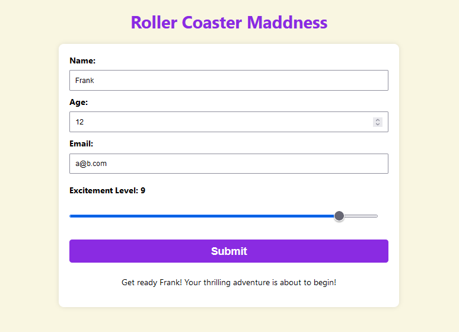

# Roller Coaster Registration

Your task is to create a registration form for a brand new theme park that's famous for its thrilling roller coasters. The theme park management wants a dynamic and engaging form built using React to collect information from excited visitors. The form should capture essential details while maintaining a fun user experience.

## Requirements:

- **Personal Information Section**

  Collect the visitor's `name`, `age`, and `email` address.
  Implement an input validation method for age. Ensure that visitors must be **at least `10` years old** to register.

- **Dynamic Confirmation**

  After submitting the form, create a dynamic confirmation statement that displays a personalized message based on the user's inputs. For example, "Get ready [Name]! Your thrilling adventure is about to begin!"

  - `[BOUNS]`: Display a warnning message below the age input if the age is below **10** years old.

- `[BOUNS]` **Excitement Level Slider**

  Include a slider input labeled "Excitement Level" allowing users to rate their excitement level from 1 to 10. Ensure that the slider's appearance matches the theme park's vibrant and thrilling atmosphere.

## Preview

